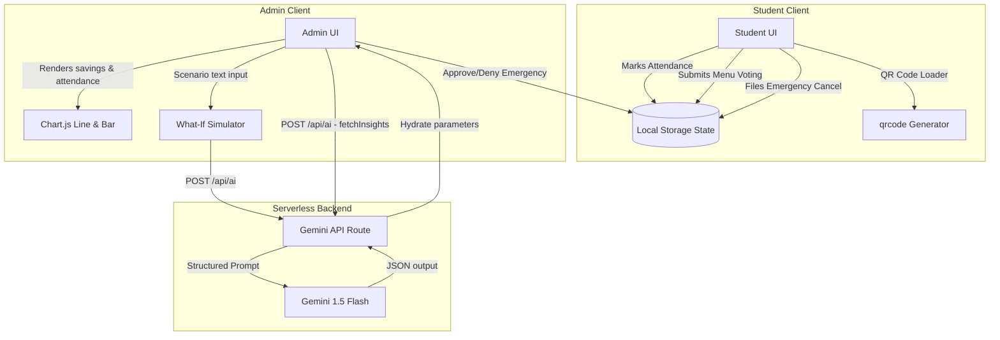

# 🍽️ SmartPlate AI — PG Mess Food Waste Reduction System

SmartPlate AI is an intelligent, production-ready Next.js 16 web application designed to reduce food wastage in college PG (Paying Guest) and hostel messes. It provides a data-driven bridge between students and mess administration, combining attendance predictive modeling, emergency meal change ticketing, and AI-powered cooking optimization.

---

## 🚀 Key Features

### 👨‍🎓 1. Student Portal
* **Tomorrow's Attendance**: A quick toggle letting mess staff know if you'll eat tomorrow. Includes a simulated **8:30 AM lock-in feature** with a lock preview.
* **Today's Menu Feedback**: Rate recipes (thumbs up/down) and add comments to adjust mess cooking parameters (spices, portions).
* **Emergency Request Ticketing**: Instantly file short-notice cancellations or late check-in dinner requests.
* **Verifiable QR Meal Pass**: Generates a dynamic QR code client-side that students present at the counter for verified portion distribution.

### 👩‍💼 2. Admin Mess Dashboard
* **Dynamic Stats Panel**: Tracks total students, active attendance count for tomorrow, and estimated waste saved.
* **Gemini AI Insights**: Calculates predicted portions, estimated waste (kg), and financial savings, returning actionable meal prep suggestions.
* **What-If Scenario Simulator**: Simulates operational changes (e.g., swapping white rice with brown rice, or weather shifts) and projects cost and waste impact.
* **Visual Trend Charts**:
  - **7-Day Attendance Trend** (Line chart tracking registrations vs actual attendees).
  - **Cumulative Savings** (Bar chart showing money saved in INR).
* **Emergency Action Terminal**: Approve or deny pending student meal requests in real-time.
* **Daily Reminders**: Broadcast reminders to students who haven't marked attendance.

---

## 🛠️ Tech Stack
* **Framework**: Next.js 16 (App Router, static prerendering, serverless API routes)
* **Language**: TypeScript (Type-safe schemas and interfaces)
* **Styling**: Tailwind CSS v4 (Glassmorphic cards, deep dark-mode color scheme, custom pulse glowing indicators)
* **AI Model**: Gemini API (`gemini-1.5-flash` model for high-speed portion predictions and scenario analytics)
* **Visualizations**: Chart.js & `react-chartjs-2`
* **QR Generator**: `qrcode` library (rendered client-side)
* **Icons**: `lucide-react`

---

## 📂 Project Structure

```bash
smartplate-ai/
├── app/
│   ├── admin/
│   │   └── page.tsx        # Admin Dashboard (Charts, AI Simulator, Action Table)
│   ├── api/
│   │   └── ai/
│   │       └── route.ts    # Gemini API Handler (Insights & What-If evaluation)
│   ├── student/
│   │   └── page.tsx        # Student Dashboard (Attendance, QR generation, Rating)
│   ├── utils/
│   │   └── mockData.ts     # Mock database, schemas, and localStorage state sync
│   ├── globals.css         # Tailwind v4 import, scrollbars, and neon glow themes
│   ├── layout.tsx          # Root Next.js structure and Metadata
│   └── page.tsx            # Modern Login page with credentials auto-fill
├── package.json
└── tsconfig.json
```

---

## 📐 Architecture Flow



---

## ⚙️ Setup Instructions

### 1. Clone the repository and install dependencies:
```bash
npm install --legacy-peer-deps
```

### 2. Set up environment variables:
Create a `.env.local` file in the root directory and add your Gemini API Key:
```env
GEMINI_API_KEY=your_gemini_api_key_here
```
> **Note**: If `GEMINI_API_KEY` is not present, the application will automatically enter **Demo Mode** and fallback to high-fidelity simulated AI responses. The app will not crash.

### 3. Run the development server:
```bash
npm run dev
```
Open [http://localhost:3000](http://localhost:3000) in your browser.

### 4. Demo Login Credentials:
For reviewer convenience, the login screen includes **quick clickable autofill buttons**:
* **Student Login**: `student` / `student123`
* **Admin Login**: `admin` / `admin123`
