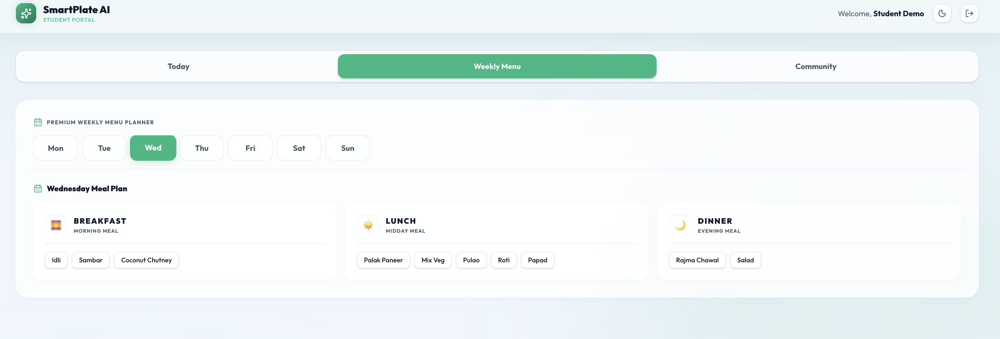
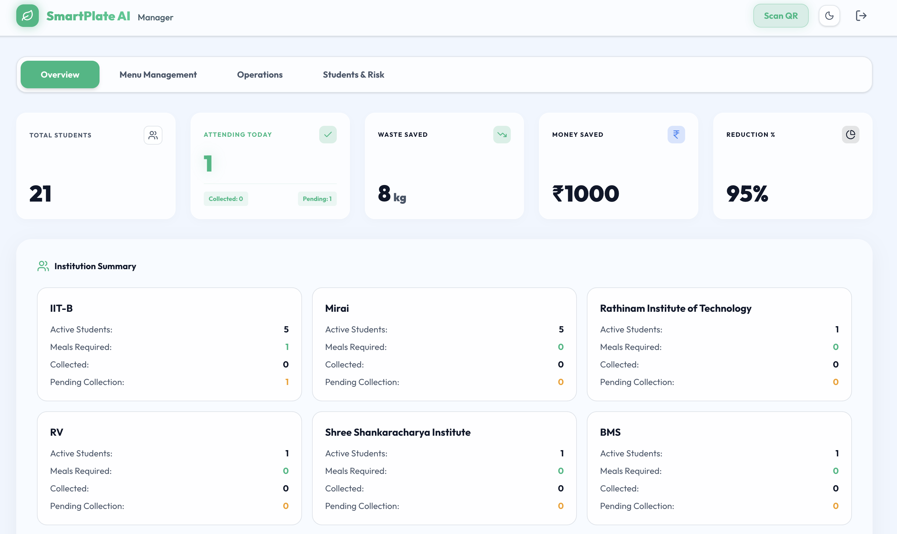
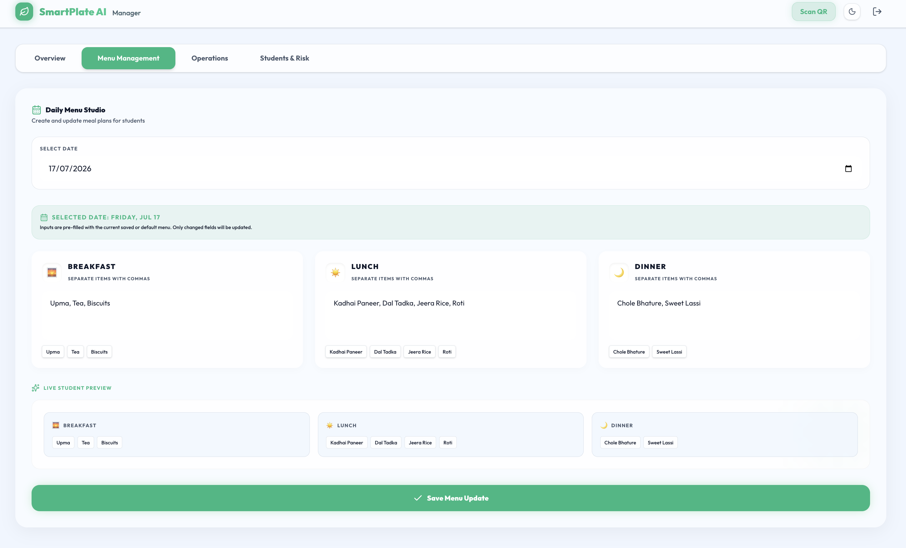
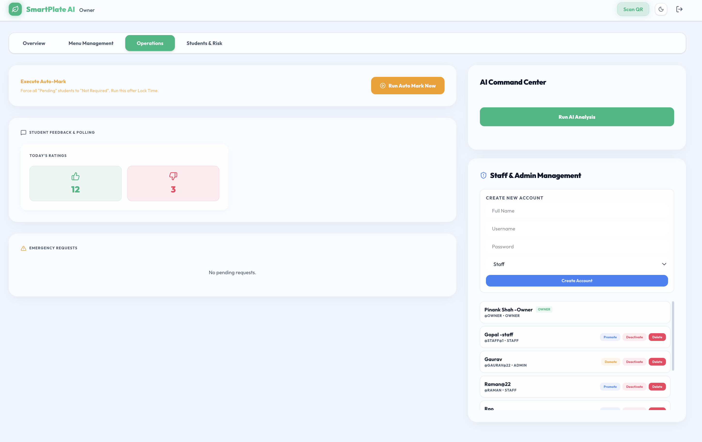

# SmartPlate AI 🍽️✨

### Predict. Vote. Save.

SmartPlate AI is an AI-powered food waste reduction and mess-management
platform designed for hostels, PGs, colleges, and institutional mess systems.

It enables students to confirm meal requirements, vote on menus, and verify
meal collection through QR codes. Staff and administrators can monitor meal
demand, manage menus, review attendance records, and use AI-supported insights
to make better food-preparation decisions.

The goal is to prepare the right amount of food, reduce unnecessary waste,
lower operational costs, and make institutional mess management smarter.

---

## 🌐 Live Demo

[SmartPlate AI Live Demo](https://smartplate-ai-two.vercel.app/)

## 🔐 Demo Login

| Role | Username | Password |
|------|----------|----------|
| Student | `student` | `student123` |
| Owner | `owner` | `admin123` |

> Demo credentials are for project demonstration only.

## 🚨 Problem Statement

In many PGs and college mess systems, food is prepared based on the total number of students instead of actual attendance or food demand. This creates multiple problems:

* **Blind Cooking:** Food is prepared for the full student count even when many students do not require meals.
* **Food & Money Wastage:** If 10 students do not take meals and each meal costs ₹50, around ₹500 can be wasted in a single day.
* **Menu Fatigue:** Students may dislike repetitive menus, leading to more uneaten food.
* **No Real-Time Data:** Staff do not get accurate attendance or food demand updates before cooking.

---

## 💡 Solution

SmartPlate AI solves this by combining:

* **Meal Intent Tracking**
* **Menu Voting**
* **QR-Based Meal Verification**
* **AI-Powered Portion Prediction**
* **Student, Staff, Admin, and Owner Dashboards**
  
The system helps staff prepare food based on actual demand instead of assumptions.

---

## ✨ Key Features

### 🎓 Student Portal

- Confirm whether a meal is required.
- View today's menu and the complete weekly menu.
- Vote and provide feedback on meals.
- Generate a personal QR code for meal collection.
- Receive deadline reminders and live status updates.

### 👨‍💼 Staff and Manager Portal

- Monitor students' meal requirements.
- View expected and collected meal counts.
- Create and update daily or weekly menus.
- Scan student QR codes to verify meal collection.
- Review attendance, collection history, and menu feedback.

### 🛡️ Admin and Owner Control

- Manage students, staff, managers, and administrators.
- Activate, deactivate, or remove user accounts.
- Assign and update role-based permissions.
- Access institution-level menus, attendance, and QR records.

### 🤖 AI and Analytics

- Predict the number of meals required.
- Analyse attendance and menu feedback.
- Provide food-preparation and waste-reduction insights.
- Display operational data through charts and dashboards.

### ⚡ Responsive Experience

- Clean responsive interface for student and staff workflows.
- Light and dark mode support.
- Designed for future real-time updates and notification support.

---

## 🚀 Hackathon USP

* **Immediate ROI:** Helps PG owners calculate money and food saved.
* **AI What-If Simulator:** Staff can ask questions like “What if it rains tomorrow?” and adjust food preparation.
* **QR Meal Verification:** Prevents duplicate meals and tracks actual consumption.
* **Simple UX:** Clean dashboards for both students and staff.
* **Real-World Impact:** Solves a practical food wastage problem in PGs and colleges.

---

## 🛠️ Tech Stack

| Category | Technologies |
|----------|--------------|
| Frontend | Next.js 16, React 19, TypeScript |
| Styling & UI | Tailwind CSS, Framer Motion, Lucide React, Sonner |
| Backend | Next.js API Routes, Node.js |
| Database | MongoDB, Mongoose |
| Authentication | JWT, bcryptjs |
| AI Integration | Google Gemini API |
| QR System | QR Code Generator, HTML5 QR Code Scanner |
| Charts & Analytics | Recharts |
| Validation | Zod |
| Deployment | Vercel |
| Version Control | Git and GitHub |

---

## 🏗️ Architecture Flow

```text
Students / Staff / Admin / Owner
                ↓
       Next.js User Interface
                ↓
   Authentication and Role Access
                ↓
      Next.js API Routes
                ↓
       MongoDB with Mongoose
                ↓
Meal Intent | Menus | Votes | QR Logs | User Data
                ↓
       Gemini AI Integration
                ↓
Meal Predictions | Insights | Waste Reduction
                ↓
   Real-Time Dashboard Updates

```

## ⚙️ How to Run Locally

### 1. Clone the Repository

```bash
git clone https://github.com/pinankshah8-Aa/Smartplate-AI.git
cd Smartplate-AI
```

### 2. Install Dependencies

```bash
npm install
```

### 3. Create Environment File

Create a `.env.local` file in the root directory:

```env
MONGODB_URI=your_mongodb_connection_string
JWT_SECRET=your_jwt_secret
GEMINI_API_KEY=your_gemini_api_key
```

If the API key is not provided, the app can use mock prediction logic for demo purposes.
Do not commit `.env.local` to GitHub. Use `.env.example` for placeholder values only.

### 4. Run the Development Server

```bash
npm run dev
```

### 5. Open the App

```text
http://localhost:3000
```

---

## 📸 Screenshots

### Login / Landing Page


### Student Today Dashboard


### Student Weekly Menu


### Admin Overview Dashboard


### Daily Menu Studio


### Owner Management



---

## 📌 Current Status

SmartPlate AI is currently a working hackathon MVP with a deployed full-stack demo.

The project includes:

- Student meal intent tracking
- Weekly menu viewing
- Menu voting and feedback
- QR-based meal collection verification
- Staff/Admin dashboard
- Owner-level role management
- MongoDB database integration
- JWT-based authentication
- AI-supported prediction and insights
- Responsive light and dark interface
- Vercel deployment

The current version is built for demo, portfolio, and open-source learning purposes.

---

## Future Improvements

- Improve production-level security and validation
- Add automated tests and CI workflow
- Improve QR scanner reliability on mobile devices
- Add more detailed monthly analytics
- Add notification scheduling for real mess workflows
- Improve AI prediction with larger historical datasets
- Add mobile app version for daily student usage
- Add beginner-friendly issues for open-source contributors

---

## 🤝 Open Source Goals

This project is being improved as part of my open-source learning journey. Future goals include:

* Writing clean documentation
* Adding beginner-friendly issues
* Improving code structure
* Adding tests
* Preparing for LFX Mentorship and GSoC

---

## 👨‍💻 Author

**Pinank Shah**
BE CSE (AI/ML) Student
GitHub: [@pinankshah8-Aa](https://github.com/pinankshah8-Aa)

---

## 📄 License

This project is licensed under the MIT License. See the [LICENSE](LICENSE) file for more details.

