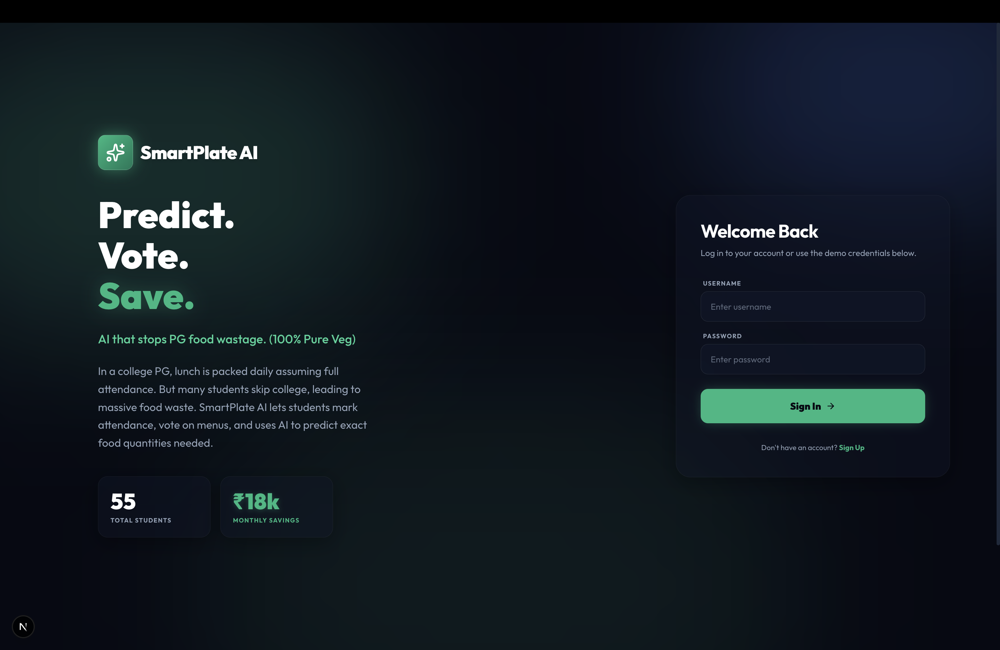
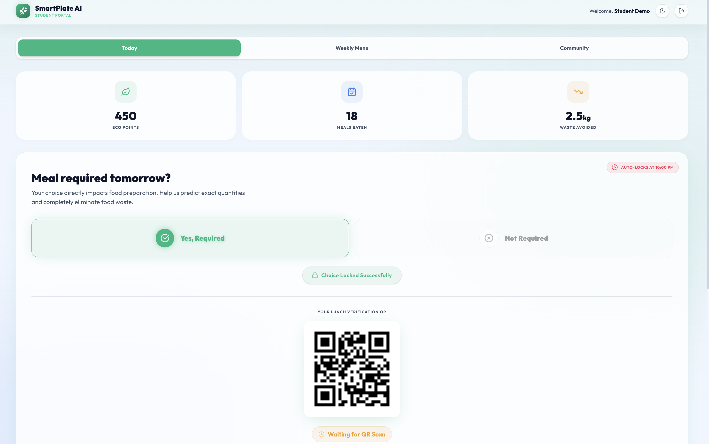
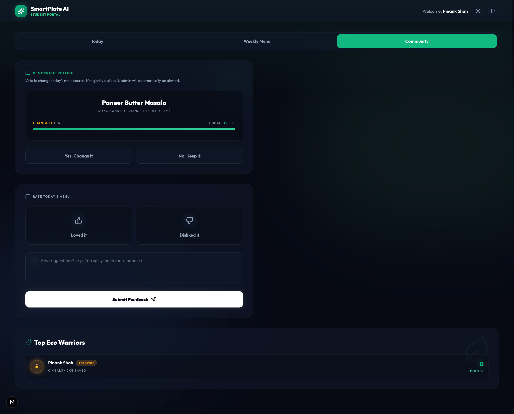
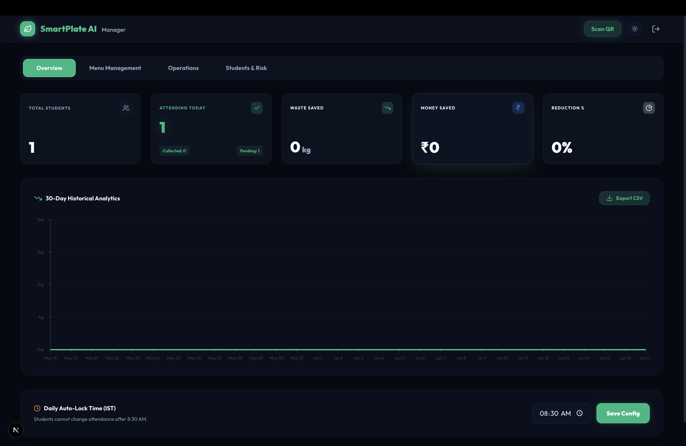
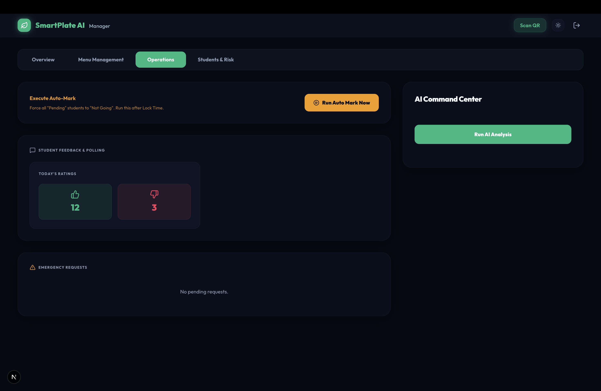
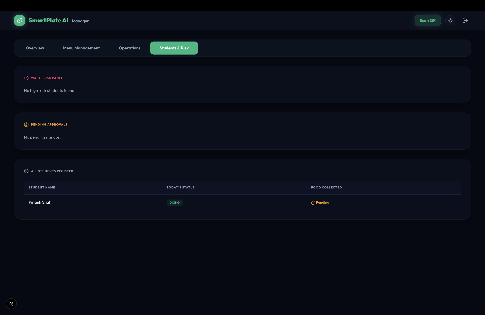

# SmartPlate AI 🍽️✨

**Predict. Vote. Save.**
An AI-powered food waste reduction platform for PG/college mess systems.

SmartPlate AI helps PG owners and college mess staff reduce food wastage by tracking student attendance intent, collecting menu feedback, verifying meal consumption using QR codes, and using AI-based predictions to estimate how much food should be prepared.

---

## 🚨 Problem Statement

In many PGs and college mess systems, food is prepared based on the total number of students instead of actual attendance or food demand. This creates multiple problems:

* **Blind Cooking:** Food is prepared for the full student count even when many students skip college.
* **Food & Money Wastage:** If 10 students skip college and each meal costs ₹50, around ₹500 can be wasted in a single day.
* **Menu Fatigue:** Students may dislike repetitive menus, leading to more uneaten food.
* **No Real-Time Data:** Staff do not get accurate attendance or food demand updates before cooking.

---

## 💡 Solution

SmartPlate AI solves this by combining:

* **Attendance Intent Tracking**
* **Menu Voting**
* **QR-Based Meal Verification**
* **AI-Powered Portion Prediction**
* **Admin and Student Dashboards**

The system helps staff prepare food based on actual demand instead of assumptions.

---

## ✨ Key Features

### 👨‍🎓 Student Side

* Mark whether the student is going to college.
* View today’s menu.
* Vote on the menu.
* Generate QR code for meal verification.
* Simple and responsive user interface.

### 🧑‍💼 Admin/Staff Side

* View student attendance intent.
* Track expected meal count.
* Monitor menu feedback.
* Verify meals using QR status.
* Use AI prediction to estimate required portions.

### 🤖 AI Prediction

SmartPlate AI uses Google Gemini AI to analyze attendance and menu sentiment data to suggest:

* Estimated number of portions to cook
* Possible food wastage reduction
* Menu improvement suggestions
* What-if analysis for special situations

---

## 🚀 Hackathon USP

* **Immediate ROI:** Helps PG owners calculate money and food saved.
* **AI What-If Simulator:** Staff can ask questions like “What if it rains tomorrow?” and adjust food preparation.
* **QR Meal Verification:** Prevents duplicate meals and tracks actual consumption.
* **Simple UX:** Clean dashboards for both students and staff.
* **Real-World Impact:** Solves a practical food wastage problem in PGs and colleges.

---

## 🛠️ Tech Stack

| Category         | Technology                |
| ---------------- | ------------------------- |
| Framework        | Next.js 16                |
| Language         | TypeScript                |
| Styling          | Tailwind CSS              |
| Animations       | Framer Motion             |
| Charts           | Chart.js, react-chartjs-2 |
| QR Code          | qrcode                    |
| AI Engine        | Google Gemini API         |
| State Management | LocalStorage              |
| Runtime          | Node.js                   |

---

## 🏗️ Architecture Flow

```text
Student
   ↓
Marks Attendance + Votes Menu
   ↓
Data Stored in Local State
   ↓
QR Code Generated
   ↓
Admin Dashboard Reads Data
   ↓
Gemini AI Analyzes Attendance + Sentiment
   ↓
Prediction Output: Required Portions + Waste Savings
```

---

## ⚙️ How to Run Locally

### 1. Clone the Repository

```bash
git clone https://github.com/pinankshah8-Aa/Smartplate-AI.git
cd Smartplate-AI
```

### 2. Install Dependencies

```bash
npm install
```

### 3. Create Environment File

Create a `.env.local` file in the root directory:

```env
GEMINI_API_KEY=your_gemini_api_key
```

If the API key is not provided, the app can use mock prediction logic for demo purposes.

### 4. Run the Development Server

```bash
npm run dev
```

### 5. Open the App

```text
http://localhost:3000
```

---

## 🔑 Demo Credentials

### Admin Login

```text
Username: admin
Password: admin123
```

---

## 📸 Screenshots

### Login / Landing Page



### Student Today Dashboard



### Student Community & Voting



### Manager Overview Dashboard



### Manager Operations Panel



### Manager Students & Risk Panel




---

## 📌 Current Status

This project is currently a hackathon MVP. It demonstrates the core idea using frontend dashboards, local state, QR generation, and AI-based prediction.

---

## 🔮 Future Improvements

* Add MongoDB database integration.
* Add real-time updates using WebSockets.
* Add Web Push Notifications.
* Add secure authentication.
* Add role-based access for students and staff.
* Add proper QR scanner module.
* Add analytics for monthly food wastage.
* Add test cases and CI workflow.
* Deploy full-stack version.

---

## 🤝 Open Source Goals

This project is being improved as part of my open-source learning journey. Future goals include:

* Writing clean documentation
* Adding beginner-friendly issues
* Improving code structure
* Adding tests
* Preparing for LFX Mentorship and GSoC

---

## 👨‍💻 Author

**Pinank Shah**
BE CSE (AI/ML) Student
GitHub: [@pinankshah8-Aa](https://github.com/pinankshah8-Aa)

---

## 📄 License

This project is licensed under the MIT License. See the [LICENSE](LICENSE) file for more details.

